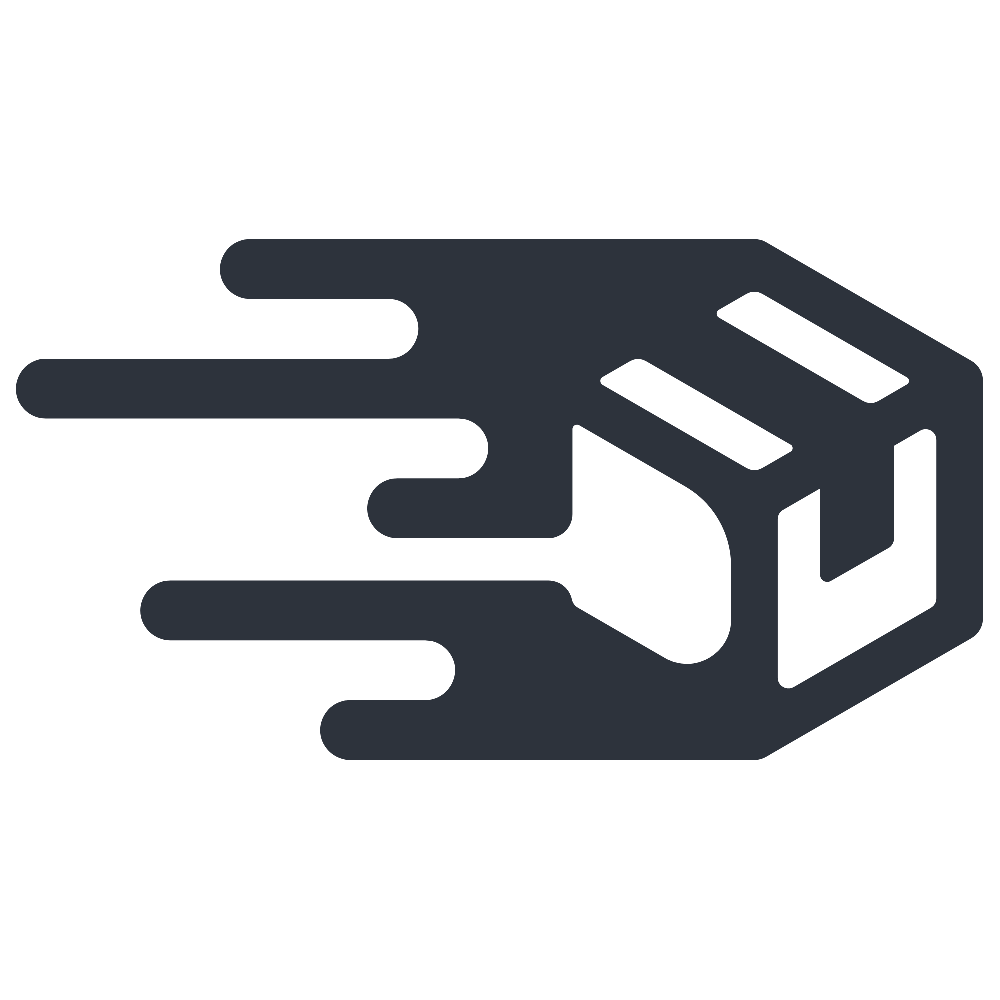

# Yash Sookdeo

**I build companies and ship products.**

Payments infrastructure powering Africa's biggest brands. Autonomous AI agents running businesses on autopilot. Fleet intelligence for logistics at scale. I operate at the intersection of fintech, AI, and real-world systems — from POS terminals in retail stores to serverless backends processing millions.

---

### Ventures

 &nbsp;**[Stitch](https://stitch.money)** — South Africa's leading payments platform. $107M funded. Powers payments for MTN, Vodacom, Takealot, FlySafair, Hollywoodbets. I build across the full stack — online payments, open banking, card-present terminal systems, and merchant infrastructure.

 &nbsp;**[Nexion Technologies](https://nexiontech.co.za)** — AI agents and autonomous workflows that run businesses and manage lives. Fully on autopilot.

 &nbsp;**[SkyLog](https://skylog.co.za)** — Enterprise fleet management. Real-time tracking, seven core modules, deep analytics. Architected from zero.

---

### Arsenal

**Languages** &nbsp;    

**Mobile** &nbsp;   

**Frontend** &nbsp;     

**Backend** &nbsp;     

**Data** &nbsp;      

**Cloud & Infra** &nbsp;      

---

ex-Nedbank · ex-IBM · Cape Town, South Africa
